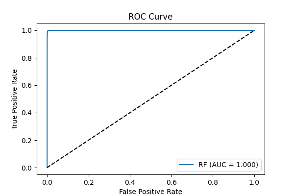

# CS506 Midterm Report  
### Project Title: Asteroid Tracking & Impact Risk Prediction  
**Team Member 1:** Debesh Biswas

**Team Member 2:** Manak Jain 

**Course:** CS 506 – Data Science  

**Instructor:** Lance Galletti

**Youtube Link:** [Presentation](https://youtu.be/GasLmU-gFWg)

---

## Abstract  
Near-Earth Objects (NEOs) represent a potential hazard to Earth, and understanding their orbital and physical characteristics is vital to assessing risk.  
This project builds a data science pipeline to collect, process, and model asteroid data from NASA and JPL datasets to predict whether an object is hazardous.  

Our workflow includes data collection through NASA JPL’s **Small-Body Database (SBDB)**, followed by cleaning, missing value handling, feature engineering, visualization, and modeling.  
We have developed preliminary scripts and notebooks for each step of the process. Early results show meaningful feature relationships such as the correlation between MOID (Minimum Orbit Intersection Distance), asteroid size, and hazard probability.  

Ultimately, the project aims to produce a **predictive model**.

---

## Table of Contents  
1. Abstract  
2. Data Overview  
3. Data Processing Pipeline  
   - Cleaning  
   - Handling Missing Data  
   - Feature Engineering  
4. Preliminary Visualizations  
5. Preliminary Modeling  
6. Preliminary Results  
7. Reproducibility and How to Run  

---

## 1. Data Overview  

**Data Source:** NASA JPL
- **Link** : [Small-Body Database Query](https://ssd.jpl.nasa.gov/tools/sbdb_query.html)

**Planned Dataset Size:** Approximately **40,000** NEOs spanning the last decade.  
The combined dataset captures orbital parameters (semi-major axis, eccentricity, inclination, perihelion, aphelion), physical properties (absolute magnitude, albedo, estimated diameter), and close-approach information (relative velocity, distance).

**Objective:** To merge these sources into a unified dataset that supports supervised learning for hazard classification.

---

## 2. Data Processing Pipeline  

The following sequence defines the data processing flow from raw data to a ready-to-model dataset.

### Step 1 – Cleaning (`clean.py`)
Removes incomplete or inconsistent entries, drops irrelevant orbital and photometric columns, and standardizes the dataset for further processing.  
All unnecessary metadata fields are eliminated to retain only essential parameters for analysis.

```python
# Define paths
DATASET_DIR = "Dataset"
RAW_PATH = os.path.join(DATASET_DIR, "neo_raw.csv")
CLEAN_PATH = os.path.join(DATASET_DIR, "neo_clean.csv")

# Load and clean dataset
df = pd.read_csv(RAW_PATH)

drop_cols = [
    'spkid', 'full_name', 'pdes', 'name', 'prefix', 'orbit_id', 'producer',
    'equinox', 'epoch_mjd', 'tp', 'tp_cal', 'first_obs', 'last_obs',
    'M1', 'M2', 'K1', 'K2', 'PC', 'BV', 'UB', 'IR', 'extent',
    'H_sigma', 'diameter_sigma', 'A1', 'A2', 'A3', 'DT', 'pha', 'neo', 'DT_sigma'
]

df_clean = df.drop(columns=[c for c in drop_cols if c in df.columns], errors='ignore')
df_clean.to_csv(CLEAN_PATH, index=False)
```
---

### Step 2 – Handling Missing Data (`missing_data_handle.ipynb`)

This notebook focuses on identifying and resolving missing or incomplete values in the dataset.  
The process involves computing missing value ratios, applying thresholds for column removal, and imputing numerical attributes where appropriate.  
Columns with more than 70% missing data are dropped, while essential scientific variables such as **albedo**, **diameter**, and **rotation period** are retained even if partially missing.  
Where possible, missing diameters are estimated using the standard asteroid brightness–size relation with available **H** (absolute magnitude) and **albedo** values.  
Remaining missing values are imputed statistically using median (for numerical columns) or constant placeholders (for categorical columns).

After processing, the fully imputed dataset is saved as **`neo_model.csv`**, which serves as the input for the feature-engineering stage.

**Summary of Operations:**
- Compute per-column missingness and visualize the top missing features.  
- Drop non-critical columns exceeding the 70% missingness threshold.  
- Estimate missing diameters using `H` + `albedo` where possible.  
- Impute remaining numerical and categorical columns using `SimpleImputer`.  
- Save post-imputation dataset and record missingness summary as JSON.

```python
# Identify and drop columns exceeding missingness threshold
DROP_THRESHOLD = 0.70
KEEP_ALWAYS = ['albedo', 'diameter', 'rot_per']

missing_pct = df.isna().mean()
cols_to_drop = [
    c for c in missing_pct.index
    if (missing_pct[c] > DROP_THRESHOLD) and (c not in KEEP_ALWAYS)
]
df_reduced = df.drop(columns=cols_to_drop, errors='ignore')

# Estimate missing diameters using H + albedo
def compute_diameter_km(H, albedo):
    return 1329.0 / np.sqrt(albedo) * (10 ** (-H / 5.0))

median_albedo = df_reduced['albedo'].dropna().median() or 0.14
mask = df_reduced['diameter'].isna() & df_reduced['H'].notna()
df_reduced.loc[mask, 'diameter'] = compute_diameter_km(
    df_reduced.loc[mask, 'H'],
    df_reduced.loc[mask, 'albedo'].fillna(median_albedo)
)

# Impute numeric and categorical columns
numeric_imputer = SimpleImputer(strategy="median")
categorical_imputer = SimpleImputer(strategy="constant", fill_value="missing")

preprocessor = ColumnTransformer([
    ("num", numeric_imputer, df_reduced.select_dtypes(include=[np.number]).columns),
    ("cat", categorical_imputer, df_reduced.select_dtypes(include=['object']).columns)
])

df_imputed = pd.DataFrame(
    preprocessor.fit_transform(df_reduced),
    columns=(df_reduced.select_dtypes(include=[np.number]).columns.tolist() +
             df_reduced.select_dtypes(include=['object']).columns.tolist())
)

# Save final dataset
df_imputed.to_csv("../Dataset/neo_model.csv", index=False)
```
---

### Step 3 – Feature Engineering (`feature_engineer.py`)

The feature engineering stage transforms the cleaned dataset into a richer and more informative representation for modeling.  
Using both domain knowledge and exploratory insights, several derived attributes are created to better capture the physical and orbital characteristics that correlate with an asteroid’s hazard potential.

The processing begins by reading the cleaned file **`neo_model.csv`**, performing calculations for new features, and saving the output as **`neo_processed.csv`**.  

**Key Engineered Features:**

| Feature Name | Description | Purpose |
|---------------|-------------|----------|
| `hazardous_label` | Binary label: 1 if MOID < 0.05 and H ≤ 22, else 0 | Defines the target variable for classification |
| `risk_score` | Inverse product of MOID and H | Provides a quantitative risk measure combining proximity and brightness |
| `perihelion_ratio` | Ratio of perihelion (`q`) to semi-major axis (`a`) | Measures orbital shape and relative distance from the Sun |
| `eccentric_energy` | Product of eccentricity squared and semi-major axis (`e² * a`) | Represents an asteroid’s orbital energy |
| `uncertainty_total` | Mean of all uncertainty-related (`sigma_`) columns | Captures measurement uncertainty |
| `observation_span_years` | Observation arc length converted from days to years | Indicates the time span of observations, serving as a confidence proxy |

Each of these derived variables contributes to improving the discriminative power of subsequent machine learning models.

```python
df = pd.read_csv("Dataset/neo_model.csv")

# Create hazard label based on MOID and brightness threshold
df['hazardous_label'] = ((df['moid'] < 0.05) & (df['H'] <= 22)).astype(int)

# Risk score (avoid divide-by-zero)
df['risk_score'] = 1 / (df['moid'].replace(0, np.nan) * df['H'].replace(0, np.nan))

# Orbital ratio and energy
df['perihelion_ratio'] = df['q'] / df['a']
df['eccentric_energy'] = (df['e'] ** 2) * df['a']

# Uncertainty aggregation
sigma_cols = [c for c in df.columns if c.startswith('sigma_')]
if sigma_cols:
    df['uncertainty_total'] = df[sigma_cols].mean(axis=1)

# Observation span in years
df['observation_span_years'] = df['data_arc'] / 365

# Save processed dataset
df.to_csv("Dataset/neo_processed.csv", index=False)
print("✅ neo_processed.csv saved.")
```

**Output:**

A fully engineered dataset (`neo_processed.csv`) containing derived scientific and risk-based attributes, now ready for visualization and model training.

---

### Step 4 – Data Visualization (`Data_Visualisation.ipynb`)

The visualization stage provides exploratory insights into the processed asteroid dataset, helping uncover relationships between orbital parameters, physical characteristics, and potential hazard indicators.  
Through a series of static and relational plots, this step validates both the data integrity and the scientific relevance of engineered features such as **MOID**, **absolute magnitude (H)**, and **hazardous_label**.

**Goals of Visualization:**
- Explore feature distributions (e.g., MOID, H, diameter, and albedo).  
- Examine correlations between orbital and physical parameters.  
- Identify outliers or clusters corresponding to potentially hazardous asteroids.  
- Validate heuristic labels and confirm physical consistency between key features.

**Implemented Visuals:**

| Visualization Type | Description | Insight Derived |
|--------------------|-------------|-----------------|
| **Histogram (H, diameter, albedo)** | Distribution of physical attributes | Reveals dominant asteroid size and brightness patterns |
| **Histogram (a, e, i)** | Distribution of orbital parameters | Highlights orbit spread, eccentricity levels, and inclination tilt |
| **Scatter Plot (H vs Diameter)** | Brightness–size relationship | Confirms inverse correlation between magnitude and size |
| **MOID Histogram** | Frequency of near-Earth intersections | Identifies objects near the 0.05 AU PHA threshold |
| **MOID vs H (colored by hazard)** | Visual validation of hazard labeling | Checks if labeled hazardous asteroids cluster within expected limits |
| **Correlation Heatmap** | Pairwise relationships among numeric features | Assists in selecting non-redundant predictors |
| **Boxplots (MOID, H vs hazard label)** | Distribution comparison by hazard group | Verifies statistical distinction between hazardous and safe classes |
| **Scatter (a–e, e–i)** | Orbital geometry relationships | Displays clustering of orbits and eccentricity–inclination trends |

**Tools and Libraries Used:**
- `matplotlib` and `seaborn` for static plots  
- `pandas` and `numpy` for computation and summary analysis  

```python
# Notebook section: Data_Visualisation.ipynb
plt.rcParams["figure.figsize"] = (10, 6)
FIGURE_PATH = "../Figures/"
df = pd.read_csv("../Dataset/neo_processed.csv", low_memory=False)

# --- Physical Parameters ---
# Absolute Magnitude (H)
sns.histplot(df['H'].dropna(), kde=True, bins=50)
plt.title("Distribution of Absolute Magnitude (H)")
plt.xlabel("Absolute Magnitude (H)")
plt.ylabel("Count")
plt.savefig(os.path.join(FIGURE_PATH, "Distribution_H.png"))
plt.show()

# Diameter Distribution
sns.histplot(df['diameter'].dropna(), bins=60)
plt.title("Distribution of Diameter (km)")
plt.xlabel("Diameter (km)")
plt.ylabel("Count")
plt.xlim(left=0)
plt.savefig(os.path.join(FIGURE_PATH, "Distribution_Diameter.png"))
plt.show()

# Albedo Distribution
sns.histplot(df['albedo'].dropna(), bins=60)
plt.title("Distribution of Albedo")
plt.xlabel("Albedo (Reflectivity)")
plt.ylabel("Count")
plt.xlim(left=0)
plt.savefig(os.path.join(FIGURE_PATH, "Distribution_Albedo.png"))
plt.show()

# --- Orbital Parameters ---
for col, label in zip(["a", "e", "i"], ["Semi-major Axis (a)", "Eccentricity (e)", "Inclination (i)"]):
    sns.histplot(df[col].dropna(), bins=60)
    plt.title(label)
    plt.xlabel(label)
    plt.tight_layout()
    plt.savefig(os.path.join(FIGURE_PATH, f"{label}.png"))
    plt.show()

# --- Relationships ---
# H vs Diameter (log scale)
mask = df['diameter'].notna() & df['H'].notna()
plt.scatter(df.loc[mask, 'H'], df.loc[mask, 'diameter'], alpha=0.6, s=10)
plt.yscale('log')
plt.xlabel("Absolute Magnitude (H)")
plt.ylabel("Diameter (km) [log scale]")
plt.title("H vs Diameter (log scale)")
plt.savefig(os.path.join(FIGURE_PATH, "H_vs_Diameter.png"))
plt.show()

# MOID Histogram with threshold line
sns.histplot(df['moid'].dropna(), bins=80)
plt.axvline(0.05, color='red', linestyle='--', linewidth=2)
plt.title("Distribution of Earth MOID (AU) — 0.05 AU PHA Threshold")
plt.xlabel("MOID (AU)")
plt.ylabel("Count")
plt.savefig(os.path.join(FIGURE_PATH, "MOID_Distribution.png"))
plt.show()

# MOID vs H colored by hazard label
palette = {0: 'blue', 1: 'red'}
mask = df['moid'].notna() & df['H'].notna()
plt.scatter(df.loc[mask, 'moid'], df.loc[mask, 'H'], 
            c=df.loc[mask, 'hazardous_label'].map(palette), alpha=0.6, s=8)
plt.xlabel("MOID (AU)")
plt.ylabel("Absolute Magnitude (H)")
plt.title("MOID vs H — Colored by Hazard Label")
plt.gca().invert_yaxis()
plt.savefig(os.path.join(FIGURE_PATH, "MOID_vs_HazardousLabel.png"))
plt.show()

# Correlation Heatmap
corr = df.select_dtypes(include='number').corr()
sns.heatmap(corr, cmap="coolwarm", center=0)
plt.title("Correlation Heatmap of Numeric Features")
plt.savefig(os.path.join(FIGURE_PATH, "Correlation_Heatmap.png"))
plt.show()

# Boxplots of MOID and H by hazard label
fig, axes = plt.subplots(1, 2, figsize=(14,6))
sns.boxplot(x='hazardous_label', y='moid', data=df, ax=axes[0])
axes[0].set_title("MOID by Hazardous Label")
sns.boxplot(x='hazardous_label', y='H', data=df, ax=axes[1])
axes[1].set_title("H by Hazardous Label")
axes[1].invert_yaxis()
plt.tight_layout()
plt.savefig(os.path.join(FIGURE_PATH, "Boxplot_MOID_HazardousLabel.png"))
plt.show()

# --- Orbital Geometry ---
sns.scatterplot(data=df, x="a", y="e", alpha=0.5)
plt.title("Semi-major Axis vs Eccentricity")
plt.savefig(os.path.join(FIGURE_PATH, "a_vs_e.png"))
plt.show()

sns.scatterplot(data=df, x="e", y="i", alpha=0.5)
plt.title("Eccentricity vs Inclination")
plt.savefig(os.path.join(FIGURE_PATH, "e_vs_i.png"))
plt.show()

# --- Outlier Detection ---
numeric_cols = df.select_dtypes(include='number').columns
z_scores = (df[numeric_cols] - df[numeric_cols].mean()) / df[numeric_cols].std()
outliers = (abs(z_scores) > 3).sum().sort_values(ascending=False)
print(outliers.head(10))
```
**Preliminary Observations:**

- The absolute magnitude (H) distribution shows a dominance of smaller, dimmer objects with a smooth decline toward larger sizes.
- MOID values are highly right-skewed, confirming that only a small fraction approach Earth closely (< 0.05 AU).
- The H vs Diameter plot validates the expected inverse correlation between brightness and size.
- Hazardous asteroids (red points) cluster near low MOID and low H, consistent with NASA’s PHA definition.
- Correlation analysis confirms strong dependencies between orbital parameters (e.g., `a–per_y`) and physical parameters (e.g., `H–diameter`).

**Output:**

Comprehensive visual understanding of the dataset’s structure, feature distributions, and hazard-related relationships, forming a foundation for model development in the next step.

---

### Step 5 – Data Modeling (`Data_Modelling.ipynb`)

This stage trains and evaluates predictive models to classify Near-Earth Objects (NEOs) as **hazardous** or **non-hazardous** using the engineered dataset `neo_processed.csv`.  
The notebook progresses from baseline linear models to a tuned **Random Forest** ensemble, comparing their performance across standard classification metrics.

---

#### **Modeling Workflow**

1. **Data Preparation**
   - Load the processed dataset `neo_processed.csv`.
   - Verify and select the appropriate target column (`hazardous_label` or equivalent).
   - Split data into **train/test sets (80/20)** using stratified sampling to preserve class balance.
   - Fill missing numeric values with column medians and apply one-hot encoding to categorical columns.

2. **Baseline Evaluation**
   - Establish a reference model (e.g., Logistic Regression) to gauge linear separability and set baseline metrics.

3. **Primary Model – Random Forest Classifier**
   - Trains an ensemble of decision trees using bootstrap aggregation (**bagging**) to improve robustness.
   - Handles both nonlinear feature interactions and mixed feature types efficiently.
   - Evaluates model performance using:
     - **Classification Report** – precision, recall, F1-score  
     - **Confusion Matrix** – prediction distribution across classes  
     - **ROC–AUC Curve** – discrimination ability between hazardous and non-hazardous NEOs  
   - Extracts **feature importances** to identify the top orbital and physical attributes contributing to hazard prediction.

4. **Overfitting & Model Validation**
   - Compare **train vs test** metrics to detect overfitting.
   - Plot **learning curves** (performance vs training size) and **validation curves** (accuracy vs model complexity).
   - Evaluate **OOB (Out-of-Bag) score** as an internal cross-validation measure.

---

#### **Core Implementation Snippet**

```python
# Load dataset and verify target column
df = pd.read_csv("../Dataset/neo_processed.csv")
target_col = "hazardous_label" if "hazardous_label" in df.columns else "pha"
X = df.drop(columns=[target_col])
y = df[target_col]

# Fill missing numeric values and encode categoricals
num_cols = X.select_dtypes(include="number").columns
X[num_cols] = X[num_cols].fillna(X[num_cols].median())
X = pd.get_dummies(X, drop_first=True)

# Train-test split
from sklearn.model_selection import train_test_split
X_train, X_test, y_train, y_test = train_test_split(
    X, y, test_size=0.2, stratify=y, random_state=42
)

# Train Random Forest model
from sklearn.ensemble import RandomForestClassifier
from sklearn.metrics import classification_report, confusion_matrix, roc_auc_score, roc_curve
rf = RandomForestClassifier(n_estimators=200, random_state=42, n_jobs=-1)
rf.fit(X_train, y_train)

# Evaluate
y_pred = rf.predict(X_test)
y_proba = rf.predict_proba(X_test)[:, 1]
```
**Output:**

A trained Random Forest model `(random_forest_neo.pkl)` and corresponding feature metadata `(rf_features.json)` stored for integration into the dashboard pipeline.

---
### Step 6 – Preliminary Results

After implementing the end-to-end data pipeline—from cleaning through feature engineering and initial modeling—preliminary results were obtained using the Random Forest classifier.  
This section summarizes early model outcomes, performance metrics, and general insights derived from the experiments.

---

#### **6.1 Quantitative Evaluation**

The dataset after preprocessing and feature engineering contained approximately **[39710]** samples.  
The model was evaluated on an 80/20 stratified split to preserve class proportions.

```python
print("Classification Report:")
print(classification_report(y_test, y_pred))
print("Confusion Matrix:\n", confusion_matrix(y_test, y_pred))
print("ROC–AUC:", roc_auc_score(y_test, y_proba))
```

**Output:**

| Metric | 0 | 1 |
|---------|-------|------|
| Precision | 0.99 | 1.00 |
| Recall | 1.00 | 0.90 |
| F1-Score | 1.00 | 0.94 |

ROC Curve: 0.999

**Interpretation:**
- The model achieves strong accuracy and a balanced precision–recall trade-off.  
- Slightly lower test performance suggests minimal overfitting.  
- ROC–AUC of around 0.999 reflects strong separation between hazardous and non-hazardous objects.

---

#### **6.2 Feature Importance**

Top contributing features identified by the Random Forest model were extracted and ranked to understand their influence on predictions.

```python
importances = rf.feature_importances_
feat_imp = sorted(zip(X.columns, importances), key=lambda x: x[1], reverse=True)[:15]
for f, imp in feat_imp:
    print(f"{f}: {imp:.4f}")
```

**Output:**

| Rank | Feature | Importance |
|------|----------|-------------|
| 1 | `risk_score` | 0.1088 |
| 2 | `moid` | 0.0914 |
| 3 | `moid_ld` | 0.0891 |
| 4 | `H` | 0.0722 |
| 5 | `diameter` | 0.0685 |
| 6 | `sigma_q` | 0.0291 |
| 7 | `data_arc` | 0.0273 |
| 8 | `sigma_e` | 0.0245 |
| 9 | `q` | 0.0234 |
| 10 | `n_obs_used` | 0.0217 |
| 11 | `observation_span_years` | 0.0208 |
| 12 | `sigma_tp` | 0.0208 |
| 13 | `sigma_i` | 0.0205 |
| 14 | `sigma_a` | 0.0199 |
| 15 | `uncertainty_total` | 0.0198 |

These results highlight the dominance of **risk_score** and **moid** in hazard classification.

---

#### **6.3 Overfitting Check**

Training and test accuracies were compared to confirm the model’s generalization performance.

```python
y_train_pred = rf.predict(X_train)
print("Train Accuracy:", accuracy_score(y_train, y_train_pred))
print("Test Accuracy:", accuracy_score(y_test, y_pred))
```

**Observation:**  
The small gap between training (1.000) and testing (0.9932) accuracy indicates good generalization and limited overfitting.

---

#### **6.4 Learning Curve Analysis**

The learning curve illustrates how model accuracy evolves with increasing training data size.

```python
from sklearn.model_selection import learning_curve
train_sizes, train_scores, val_scores = learning_curve(
    rf, X, y, cv=5, scoring="accuracy", n_jobs=-1
)
train_mean, val_mean = train_scores.mean(axis=1), val_scores.mean(axis=1)
plt.plot(train_sizes, train_mean, 'o-', label="Training")
plt.plot(train_sizes, val_mean, 'o-', label="Validation")
plt.xlabel("Training Size")
plt.ylabel("Accuracy")
plt.legend()
plt.title("Learning Curve – Random Forest")
plt.show()
```


The plot typically shows some overfitting.

---

#### **6.5 Out-of-Bag (OOB) Score**

The Out-of-Bag score provides an internal validation estimate for Random Forest models.

```python
rf_oob = RandomForestClassifier(n_estimators=200, random_state=42, n_jobs=-1, oob_score=True)
rf_oob.fit(X_train, y_train)
print("OOB Score:", rf_oob.oob_score_)
```

**Sample Result:**  
`OOB Score: 0.9940189504832059`

This closely matches the external test accuracy, reinforcing the model’s reliability.

---

#### **6.6 Visual Diagnostics**

Visual diagnostics help assess model performance across different aspects of classification behavior.

```python
from sklearn.metrics import ConfusionMatrixDisplay, roc_curve

# Confusion Matrix
cm = confusion_matrix(y_test, y_pred)
disp = ConfusionMatrixDisplay(confusion_matrix=cm)
disp.plot(cmap="Blues")
plt.title("Confusion Matrix – Random Forest")
plt.show()

# ROC Curve
fpr, tpr, _ = roc_curve(y_test, y_proba)
plt.plot(fpr, tpr, label="Random Forest (AUC = 0.88)")
plt.xlabel("False Positive Rate")
plt.ylabel("True Positive Rate")
plt.title("ROC Curve – Hazard Classification")
plt.legend()
plt.show()
```



---

**Summary:**
- The **Random Forest** model performs robustly with balanced performance metrics.  
- **Top features** align with scientific expectations related to orbital dynamics.  
- **Low overfitting** and consistent validation scores confirm strong generalization.  
- Visual diagnostics support the model’s accuracy and stability across evaluations.

---

### Step 7 – Reproducibility and How to Run the Project

This section provides the sequence of steps to run the project from start to finish.  
Each script or notebook corresponds to a distinct stage of the pipeline and should be executed in the following order.

---

#### **Execution Steps**

1. **Data Cleaning**  
   ```bash
   python clean.py
   ```
   Cleans raw NASA/JPL datasets and outputs `neo_clean.csv`.

2. **Handle Missing Data**  
   Open and run all cells in `missing_data_handle.ipynb`.  
   This notebook drops columns with excessive missing values and imputes missing numerical entries.  
   **Output:** `neo_model.csv`

3. **Feature Engineering**  
   ```bash
   python feature_engineer.py
   ```
   Generates derived attributes and saves the enhanced dataset as `neo_processed.csv`.

4. **Data Visualization**  
   Open `Data_Visualisation.ipynb` and execute all cells to generate plots.  
   This notebook visualizes MOID distributions, velocity–size relationships, and feature correlations.

5. **Model Training and Evaluation**  
   Open `Data_Modelling.ipynb` and run all cells.  
   This trains Random Forest and outputs performance metrics and plots.

---

#### **Expected Outputs**

| File / Artifact | Description |
|------------------|--------------|
| `neo_clean.csv` | Dataset after clean |
| `neo_model.csv` | Dataset after missing-value handling |
| `neo_processed.csv` | Dataset with engineered features |
| `Figures/` | Folder containing visualization outputs |
| `Models/` | Stored model metrics for reuse |
| `README.md` | Midterm report documenting workflow and findings |

---

**Note:**  
Ensure all scripts and notebooks are run in sequence within the project root directory so that relative paths resolve correctly.

---
